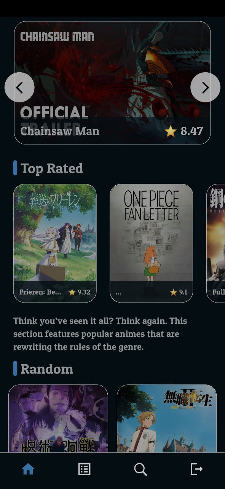
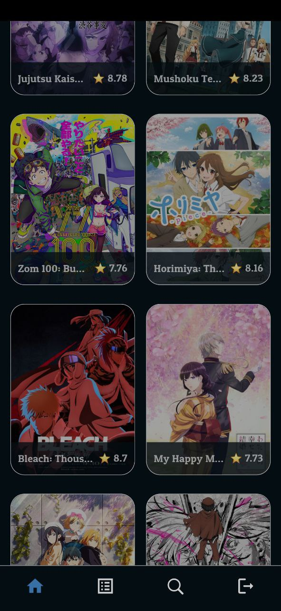
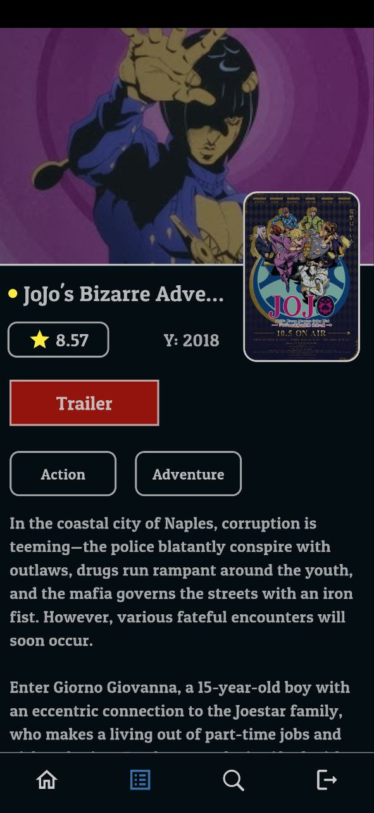
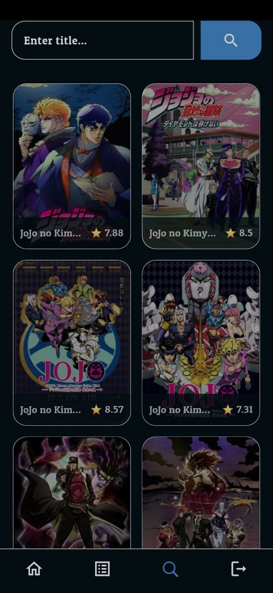
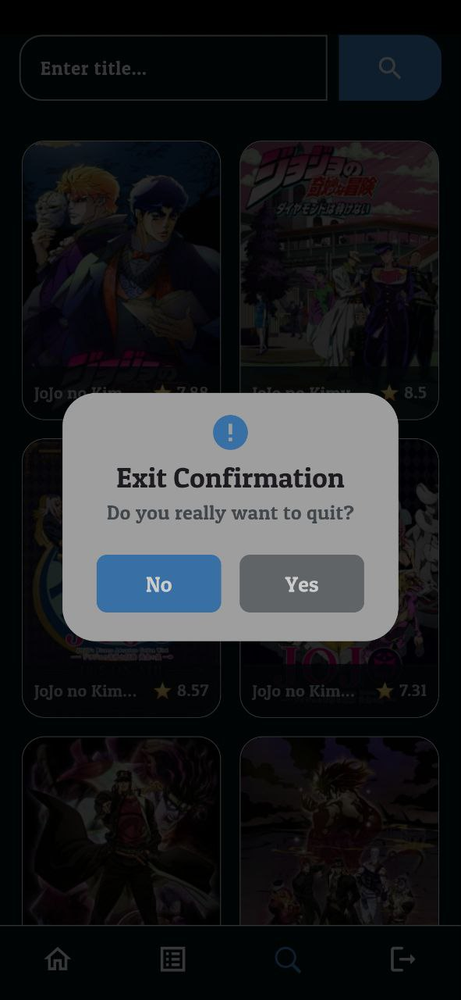

# Ani WRLD

Anime Database. An Application to review Anime Movies and Anime TV Series. In this application, users can search and review the animes, they can find about the trending animes and they also can find the seasonal, new animes that they might enjoy.  

## Review Application

  
  
   
    
     
      

